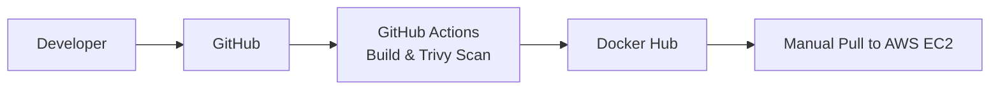

<div align="center">

</div>

# Run and deploy your AI Studio app

This contains everything you need to run your app locally.

View your app in AI Studio: https://ai.studio/apps/temp/1

## Run Locally

**Prerequisites:**  Node.js


1. Install dependencies:
   `npm install`
2. Set the `GEMINI_API_KEY` in [.env.local](.env.local) to your Gemini API key
3. Run the app:
   `npm run dev`

## DevOps & CI/CD Architecture

The project uses GitHub Actions to verify the frontend, build and scan its production
container, and publish the image to Docker Hub. Deployment to an AWS EC2 instance is
intentionally manual.



### Required GitHub Secrets

Configure these repository secrets under **Settings → Secrets and variables → Actions**:

- `DOCKERHUB_USERNAME` — Docker Hub username used in the image tag.
- `DOCKERHUB_TOKEN` — Docker Hub access token used to authenticate image pushes.

### Manual EC2 Deployment

After installing Docker on the EC2 instance, pull and run the latest image:

```bash
docker pull <username>/ai-fitness-agent:latest
docker run -d -p 80:80 <username>/ai-fitness-agent:latest
```
